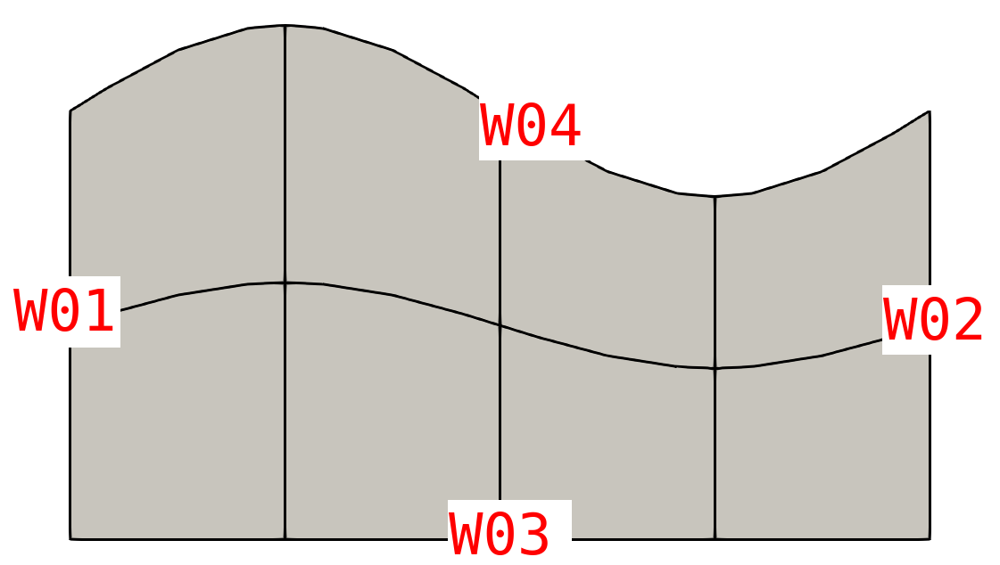

# Tutorial for splitting elements

Follow the `Step` in the user file.
Our input mesh is a 2 x 4 wavy box where the curves are assigned in userdat2.


Note that the BC in re2 are 



You can find the following BC count called by `my_cbc_chk` at `usrdat2`
```
 re2BC: E            20
 re2BC: W03           4
 re2BC: W02           2
 re2BC: W04           4
 re2BC: W01           2
 re2BC: sum          32
```

- Step 1: Back up BC from re2.
  
  When split elements, the new elements will inherit the BC form the original elements.   
  Plus, we need to use CBC to tag elements so the original one should be backed up.
  The newly generated re2 will automatically recover the correct BC from re2.

  ```
      call rfn_backup_boundary_id(1)
  ```

- Step 2: Set up dummy BC to do refinement
  You can either using boundaryID or CBC to tag elements. In this example, we use CBC.       

  

  The dummy CBC are set as follow. The fluid flows from left (`v  `) to right (`O  `). Wavy wall at the top (`W  `) and `SYM` at the bottom.


- Step 3: refine demo       

  - Number of layers: Let's refine the wavy wall by splitting the top layer into three.   
    ```
  Nref = 3  ! 1 layer -> 3 layers of elements, max(Nref) <= lref
    ```

  - Thickness of each layers     
    User also need to specify the ratio of the splitting. For example, set the first layer to be 5\%.
    For the second layer, use 45% of the remaining space after subtracting the first layer.
    The rest is for third layer.
    The layers are numbered from boundary so the first layer will attached to boundary.
    ```
        ! ratio for splitting in (0,1), from bdry to interior
        Rref(1) = 0.05                ! first layer (on bdry) is 5%
        Rref(2) = 0.45*(1.0-Rref(1))  ! second layer is 45% of the remaining 95%
                                      ! remaining space is for third layer (1 - 5% - 45% x 95%)
    ```

  - Boundary id      
    There are two ways to tag elements. 
    `bID>0`: This will use `boundaryID = bID`     
    `bID==0`: This will use CBC. In the example, we have `CBC = 'W  '`

    User should know that, if you use boundaryID, you might need to map boundaryID to CBC before dumping the final re2. In other words, the CBC might be incomplete and re2 relies on boundaryID.

   - limiter      
     There are two limiters

     ***Limiter 1:*** global limiter         
     Each layers (except the final one), you can control the min/max thickness. 
     The global limiter will find a ratio for entire layer such that it satisfies the condition.
     If the number is zero, it's turned off.

     It's not recommanded to set both min and max for the same layer. The min will do first then the max might overwrite the min condition if there is a controdiction.  Pleae don't abuse this :)

     See Step 6 for another example.
     ```
        Rlim(1,1) = 0.05   ! layer 1, min thickness is at least 0.05
        Rlim(2,1) = 0.0    ! layer 1, max thickness, 0 = do nothing
        Rlim(1,2) = 0.2    ! layer 2, min thickness is at least 0.2
        Rlim(2,2) = 0.0    ! layer 2, max thickness, 0 = do nothing
     ```

     ***Limiter 2*** local limiter (experimental, this is buggy?)
     The local limiter only apply locally by consider all edges one by one.
     If there is one element shorter than min-control, only that edge will be modified.   
     However, this requires a full reconstruction of Gordon-Hall mapping. 
     It might not work well when the elements are thin or highly curved.
     ```
        Rlim(3,1) = 0.0    ! layer 1 min thickness
        Rlim(4,1) = 0.0    ! layer 1 max thickness
        Rlim(3,2) = 0.0    ! layer 2 min thickness
        Rlim(4,2) = 0.0    ! layer 2 max thickness
     ```

- Step 4: dump mesh     
  Set `ifbinary=.true.` for re2 file. Otherwise, rea file (only the mesh portion)   
  By default, we will dump the hex20 mesh with midpoints which could reduce the order of the mesh.   
  I also recommend to call outpost, which will carry the high order curvatures.

  `newre2aaa.re2` and `aaabox0.f00001`

  

  One can also count the new BC. You will find `W01` and `W02` increases from 2 to 4, which is expected.
  ```
 aaaBC: E            48
 aaaBC: W03           4
 aaaBC: W02           4
 aaaBC: W04           4
 aaaBC: W01           4
 aaaBC: sum          64
  ```


### More example

- Step 5: recursive refinement      
  Yes. You can call `rfn_split` multiple time. 
  Here, we do 50-50 split at outflow, three times and dump it to `bbb`

  


- Step 6: limiter    
  To demonstrate how limiter works, let's do another split at the bottom.
  Originally, it's a very thick layer so a 50-50 split will still generate thick elements.
  By setting the max-control for limiter1,
  ```
        Rlim(2,1) = 0.05   ! layer 1, max thickness = 0.05
  ```
  it first go through all elements and realize that instead of 50-50 split, we should do a 8.3-91.7 split for all elements so the maximium thickness is 0.05.

  From the logfile, you can tell ranging from [-1,1], it wants the interpolated point to be -0.83.
  ```
   rfn lim1 max   0.0000     -0.83333      0.50000E-01
  ```  

  The final outcome `ccc` also shows that the thickness of the bottom layer is not a constant. 
  It's actually still wavy.
  


