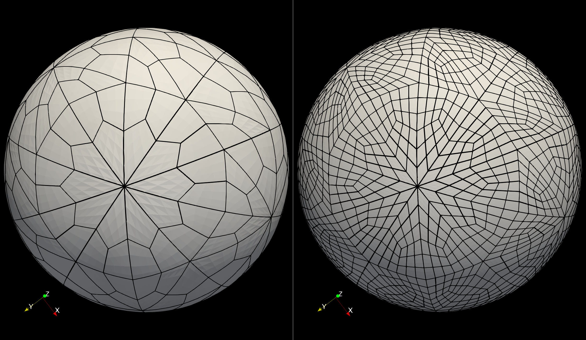

# Tutorial for surface splitting

Follow the `Step` in the user file.    
Our input mesh is a spherical shell with inner radius = 0.5 and outer radius = 1.0.    
It has 600 elements on surface x 2 layers in radius = 1200 elements in total. 
The mesh is generated by my another tool [Tet2Hex_forNek](https://github.com/yslan/Tet2Hex_forNek) using tet2hex.  

In userdat, we repair the mesh onto high-order sphere surface and we assign the CBC as the following.
```
! BC chk by `my_cbc_chk`, called at `usrchk.
000 BC:   0 PR   E        3600
000 BC:   1 VEL  E        3000
000 BC:   1 VEL  O         300     ! this is outer surface
000 BC:   1 VEL  S         300     ! this is inner surface
000 BC:   2 S00  E        3600     
```

- Step 1: Back up BC from re2.
  
  When split elements, the new elements will inherit the BC form the original elements.   
  Plus, we need to use CBC to tag elements so the original one should be backed up.
  The newly generated re2 will automatically recover the correct BC from re2.

  ```
      call rfn_backup_boundary_id(1)
  ```

- Step 2: Set up dummy BC to do refinement (no need for this example)

- Step 3: ssplit demo       

  Now, we split the elements into 9.  
  Starting with `'S  '` BC, the code will automatically identify the vertical and horizontal direction.     
  The direction will be propagated to all domain (if connected) via an internal subroutine `rfn_trace_layers`.    
  All horizontal directions will be split.
  ```
  ! split: 1 -> 9
  bID = 0
  Ncut = 2
  call rfn_ssplit('S  ',bID,Ncut)
  ```
     
- Step 4: dump mesh     
  Set `ifbinary=.true.` for re2 file. Otherwise, rea file (only the mesh portion)      
  Please discard the co2 file from this demo.

  By default, we will dump the hex20 mesh with midpoints which could reduce the order of the mesh.   
  I also recommend to call outpost, which will carry the high order curvatures.     

  `newre2aaa.re2` and `aaabox0.f00001`

- checks

  Original mesh has 600 elements. All elements are tagged (`E_lyr`)
  ```
  rfn SSPLIT START,   E=      600, E_lyr=      600 
  ```

  When it's done, it becomes 5400 elements
  ```
  rfn SSPLIT END,  E_new=     5400
  ```         

  One can also count the new BC. You will find `S  ` and `O  ` increases from 300 to 2700, which is expected.
  ```
  aaa BC:   0 PR   E       32400
  aaa BC:   1 VEL  E       27000
  aaa BC:   1 VEL  O        2700
  aaa BC:   1 VEL  S        2700
  aaa BC:   2 S00  E       32400
  ```

     
