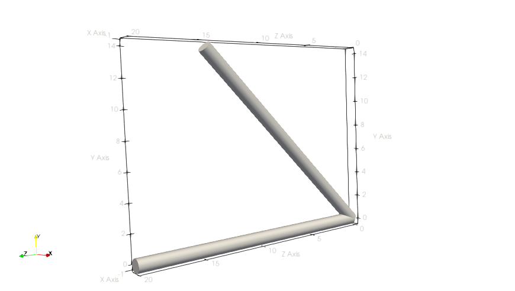
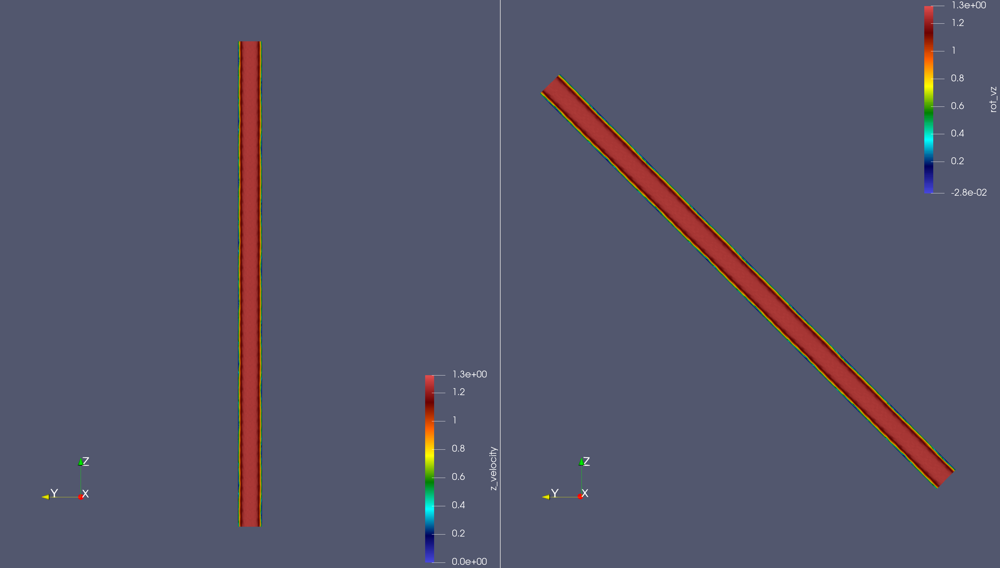
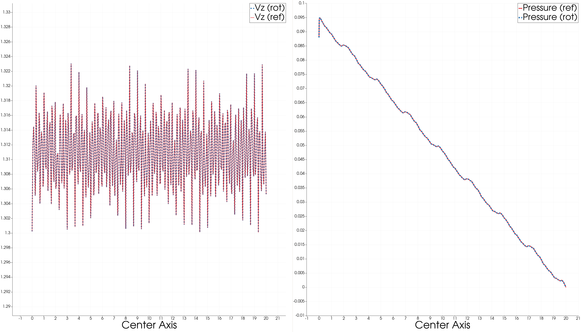

## Nek Rotate

This example rotate the mesh and the velocity based on two vectors.

From a vector $\vec a$ and rotating it to $\vector b$, the linear transformation
follows the Rodrigues' rotation formula.

$$ \vec v_{out} = \vec v_{in} \cos\theta + (\vec k \times \vec v)\sin\theta + 
\vec k(\vec k\cdot \vec v)(1-\cos\theta) $$

where $\vec k = \vec a \times \vec b / | \vec a \times \vec b |$ is the unit axis
of the roation and $\theta$ is the rotation angle from $\vec a$ to $\vec b$.

Ref: 
- [wiki](https://en.wikipedia.org/wiki/Rodrigues%27_rotation_formula)

### Verification

The subroutine can be called in userdat2 or userchk which makes this working for
both Nek5000 and NekRS. 

This particular example is copied from NekRS(v23)'s turbPipe example. 
Originally, the normal vector of inlet is $(0,0,-1)$ and we rotate it to $(0,-1,-1)$.

- Run 0: 200 steps of turbPipe from time=0
- Run 1: (ref) restart from run0, run another 200 steps
- Run 2: (rot) restart from run0, rotate mesh and velocity at $istep=0$, and run 200 steps.

Run 1 and Run 2 reproduce identical flow profile. Here we check the streamline
velocity and t=pressure along the central axis.

