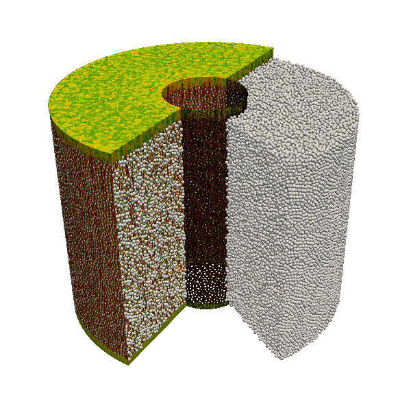

# `outpost` for selected-elements

Most of the time, we only visualize a small portion of data from a big simulation.   
For example, 
- Inspect the location where CFL is large.
- 2D slice at certain plane or surface. 

In order to reduce the data size and the visualization cost, this example shows how to generate a reduced nek outpot file that only dumpes the selected elements.

This is a modified copy of the original Nek5000's `prepost.f`. 

## Usage
1. Include `my_post.f` in the user file.
2. Set (integer) `elist(ie)=1` for the elements you want to dump, otherwise, use 0.    
   You can define the geometric surface with `Gamma(x,y,z) = 0` and determine if the elements intersect the object by finding the sign of the `max_e(Gamma)*min_e(Gamma)` in each elements.
3. `call my_outpost(elist,vx,vy,vz,pr,t,'sel')`. to dump Nek5000-format files.


## Features
- Supports nek5000 outpot formats p66=0, 4, or 6
- Supports nek5000 standard fields (velocity, pressure, temperature and passive scalars) and the control (eg: `ifxyo` and `ifreguo`)
- Tested with a 98M mesh (lx1=8).   
   ```
   original file: 98.7M elements, 1.3TB 
   selected files: 709.8k elements, 11GB. (0.719%)
   ```

## Examples

- `hemi/`    
   - Nek5000's hemi examples, read from a file for non-trivial fields   
   - only dump the elements cross `y=0` plane   

- `hemi_cfl/`      
   - an example to dump the high CFL elements

- 350k pebbles          
   ```
   Original restart file: 1.9 TB (E98.7M, lx1=9)
   Selected elements:
     1.7GB zmax plane (E76,210)
     5.8GB yz-plane (E264,961)
     6.9GB inner cylinder (E315,230)
      13GB half ouer cylinder (E584,293)
   sum = 26GB
   ```

       

   - The userchk and the related functions are posted below  


```
c-----------------------------------------------------------------------
     subroutine userchk
     include 'SIZE'
     include 'TOTAL'

     integer icalld
     save icalld
     data icalld /0/

     integer elist(lelt), ie_in_plane, ie_in_cylin, nselect
     common /imy_fld/ elist

     if (istep.eq.0) then

       ifxyo = .true.

       ! x=0, yz plane
       call izero(elist,lelt)
       do ie=1,nelv
         itmp = ie_in_plane(ie,1.0,0.0,0.0,0.0)
         elist(ie) = max(elist(ie),itmp)
       enddo
       call my_outpost(elist,vx,vy,vz,pr,t,'yzp')

       ! z~Ztop=66.438
       call izero(elist,lelt)
       do ie=1,nelv
         itmp = ie_in_plane(ie,0.0,0.0,1.0,-66.435)
         elist(ie) = max(elist(ie),itmp)
       enddo
       call my_outpost(elist,vx,vy,vz,pr,t,'ztp')

       ! inner cylinder, Rcyl=23.10
       call izero(elist,lelt)
       do ie=1,nelv
         itmp = ie_in_cylin(ie,1.0,1.0,0.0,-23.4**2)
         elist(ie) = max(elist(ie),itmp)
       enddo
       call my_outpost(elist,vx,vy,vz,pr,t,'cyi')

       ! 1/2 outer cylinder, Rcyl=83.30
       call izero(elist,lelt)
       do ie=1,nelv
         itmp = ie_in_cylin(ie,1.0,1.0,0.0,-83.0**2)
         if(xm1(1,1,1,ie).gt.0.5) itmp=0
         elist(ie) = max(elist(ie),itmp)
       enddo
       call my_outpost(elist,vx,vy,vz,pr,t,'qco')

       nselect = iglsum(elist,nelv)
       call exitti ('chk: EOF nek post, E=$',nselect)

     endif

     return
     end
c-----------------------------------------------------------------------
     function ie_in_plane(ie,a,b,c,d)
c    if element ie cross the plane ax + by + cz + d = 0, return 1
     implicit none
     include 'SIZE'
     include 'TOTAL'
     integer ie_in_plane,i,ie
     real tmp(lx1*ly1*lz1)
     real a,b,c,d,vlmin,vlmax,v1,v2

     do i=1,lx1*ly1*lz1
       tmp(i) = a*xm1(i,1,1,ie) + b*ym1(i,1,1,ie) + c*zm1(i,1,1,ie) + d
     enddo

     v1 = vlmin(tmp,lx1*ly1*lz1)
     v2 = vlmax(tmp,lx1*ly1*lz1)

     ie_in_plane = 0
     if (v1*v2.le.0.0) ie_in_plane = 1

     return
     end
c-----------------------------------------------------------------------
     function ie_in_cylin(ie,a,b,c,d) 
c    if element ie cross the cylinder ax^2 + by^2 + cz^2 + d = 0, return 1
     implicit none
     include 'SIZE'
     include 'TOTAL'
     integer ie_in_cylin,i,ie
     real tmp(lx1*ly1*lz1)
     real a,b,c,d,vlmin,vlmax,v1,v2

     do i=1,lx1*ly1*lz1
       tmp(i) = a*xm1(i,1,1,ie)**2 + b*ym1(i,1,1,ie)**2
    $         + c*zm1(i,1,1,ie)**2 + d
     enddo

     v1 = vlmin(tmp,lx1*ly1*lz1)
     v2 = vlmax(tmp,lx1*ly1*lz1)

     ie_in_cylin = 0
     if (v1*v2.le.0.0) ie_in_cylin = 1

     return
     end
-----------------------------------------------------------------------
```

